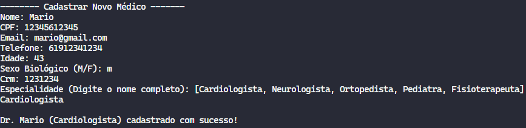
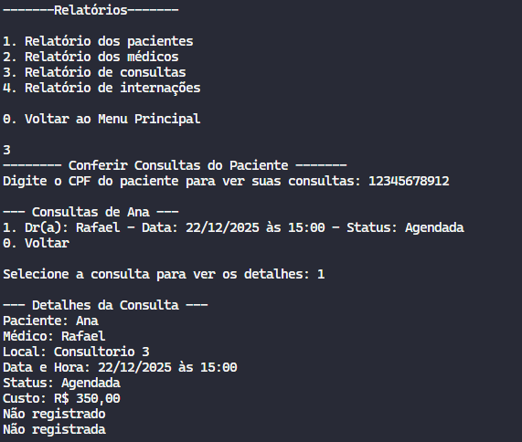

# 🏥 Trabalho Prático – Sistema de Gerenciamento Hospitalar  

### 🎯 Objetivo  
Implementar um *Sistema de Gerenciamento Hospitalar* em *Java, aplicando conceitos avançados de **Programação Orientada a Objetos (POO), com foco em **herança, polimorfismo, encapsulamento, persistência de dados* e *regras de negócio mais complexas*.  

---
## Descrição do Projeto

Desenvolvimento de um sistema de gerenciamento hospitalar utilizando os conceitos de orientação a objetos (herança, polimorfismo e encapsulamento) e persistência de dados em arquivos.

## Dados do Aluno

- **Nome completo:** Felipe Melo de Sousa
- **Matrícula:** 242015370
- **Curso:** Engenharias
- **Turma:** 02

---

## Instruções para Compilação e Execução

1. **Compilação:**  
   Clone o repositório na sua máquina. Recomendo usar o vs code. Use o comando `git clone https://github.com/Felipe-ms-sys/ep1-2025.2-FelipeMelo`

2. **Execução:**  
   Execute o programa com o botão run java

3. **Estrutura de Pastas:**

`Projeto1Poo/
├── dados/
│   ├── consultas.txt
│   ├── internacoes.txt
│   ├── locais.txt
│   ├── medicos.txt
│   └── pacientes.txt
│
├── entidades/
│   ├── Consulta.java
│   ├── Convenio.java
│   ├── Especialidade.java
│   ├── EstadoMenu.java
│   ├── Internacao.java
│   ├── Leito.java
│   ├── Local.java
│   ├── Medico.java
│   ├── Menus.java
│   ├── Paciente.java
│   └── Pessoa.java
│
├── fotos/
│   ├── cadastroMedico.png
│   ├── menuPrincipal.png
│   └── relatorioConsulta.png
│
├── sistema/
│   ├── Main.java
│   └── Persistencia.java
│
└── README.md
`
3. **Versão do JAVA utilizada:**  
   java 21.0.6

---

## Vídeo de Demonstração

- https://youtu.be/cRFtdh7Y_Kg

---

## Prints da Execução

1. Menu Principal:  
   ‎

2. Cadastro de Médico:  
   ‎

3. Relatório de ?:  
   ‎‎
   
---

## Observações (Extras ou Dificuldades)

- [- Dificuldades:
   1.Tive uma certa dificuldade no começo por conta da sintaxe do java, pelo fato de ter sido o primeiro contato com a linguagem
   2.Foi meu primeiro projeto dessa proporção, gerir o tempo e relacionar varios blocos de código foi desafiador
- Observação:
   1.Percebi um grande avanço não só no meu domínio da linguagem como também na implementação dos pilares da POO, o fato do projeto ter sido desafiador me incentivou a pesquisar mais e aprofundar meu aprendizado]

---

## Contato

- felipems.ctt@gmail.com
